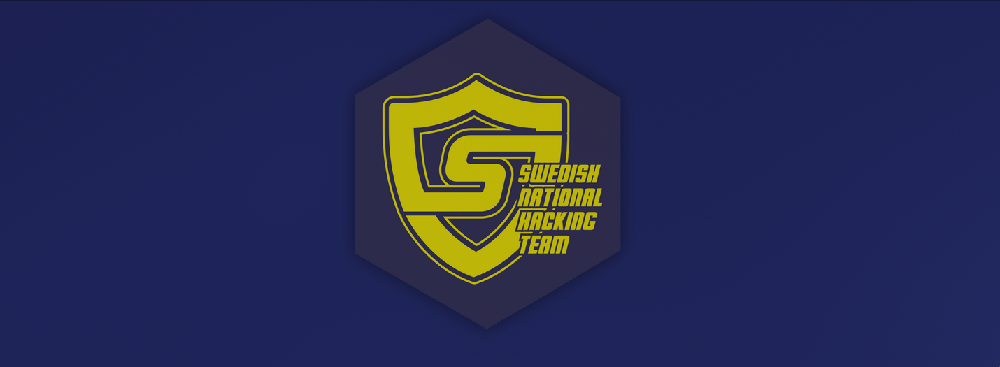

# Swedish-Cybersecurity-Challenge-2025
- https://ctf.snht.se/

## Description
*Swedish Cybersecurity Challenge 2025 will be held as a jeopardy Capture The Flag competition. The competition focuses on problem solving in the areas of programming, cryptography, binary exploitation, reverse engineering, web security and other miscellaneous tasks. The tasks range from easy to really tricky, so even if you've never participated in a CTF before, you can take part. Above all, you will learn a lot from participating.*

# Results
**Username:** arch-err

**Team:** None

**Flags:** (4/24)

# Challenges
- [ ] [b64_2TP](challenges/b64_2TP)
- [ ] [Ciggen](challenges/Ciggen)
- [ ] [Ciggen_2](challenges/Ciggen_2)
- [ ] [secRet_SignAtures](challenges/secRet_SignAtures)
- [ ] [flag.py](challenges/flag.py)
- [x] [Sanity_(rizz)_check](challenges/Sanity_(rizz)_check)
- [x] [A-a-a_Wond-wonderful_Ke-kebab](challenges/A-a-a_Wond-wonderful_Ke-kebab)
- [ ] [Dropped_flag](challenges/Dropped_flag)
- [ ] [picklepicklejail](challenges/picklepicklejail)
- [ ] [MinionCoin](challenges/MinionCoin)
- [ ] [Rizz_oriented_programming](challenges/Rizz_oriented_programming)
- [ ] [Use_after_snake](challenges/Use_after_snake)
- [ ] [Heap_of_Sort](challenges/Heap_of_Sort)
- [ ] [pelinux](challenges/pelinux)
- [x] [ClickMe](challenges/ClickMe)
- [ ] [PySafe](challenges/PySafe)
- [ ] [Knäckebröd](challenges/Knäckebröd)
- [ ] [WNACALC](challenges/WNACALC)
- [ ] [Macrohard](challenges/Macrohard)
- [ ] [RizzClicker](challenges/RizzClicker)
- [ ] [JinjaNinja](challenges/JinjaNinja)
- [ ] [MinionDB](challenges/MinionDB)
- [ ] [Unknown](challenges/Unknown)
- [ ] [Unknown_2](challenges/Unknown_2)
